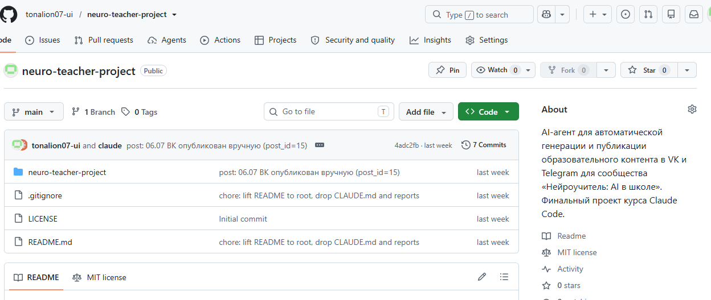
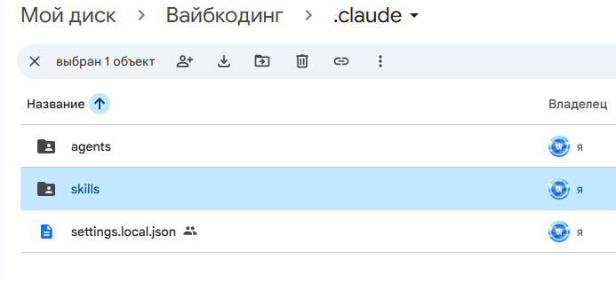
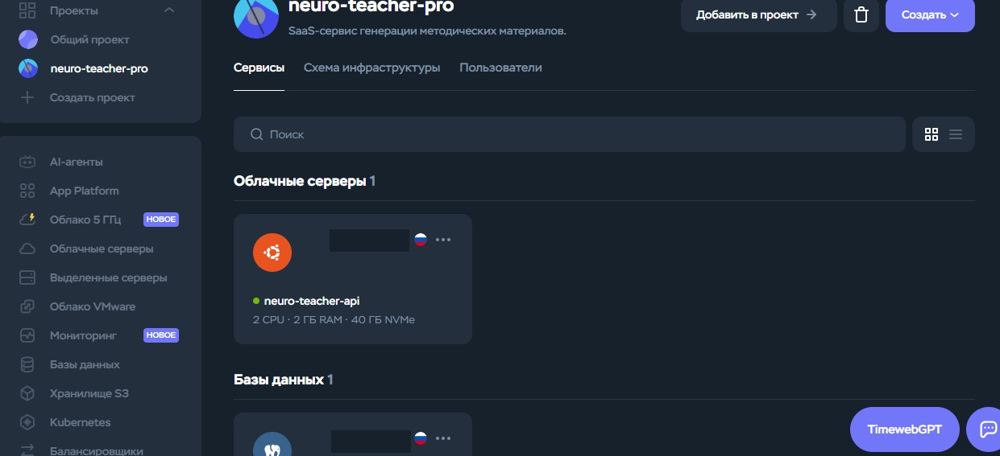

# neuro-teacher-publish — оркестратор публикации связок ВК+ТГ

> **Контент-завод «Нейроучитель: AI в школе»** — публикации в ВК-группу и Telegram `@neuro_uchitel` для школьных учителей.
> **Этот репо** — рабочий инструмент автопостинга, 3-агентного ревью и журналирования.
> **Парный репо / продолжение** — `neuro-teacher-pro` (план развития на месяц: `docs/2026-07-14-neuro-teacher-pro-monthly-plan.md`).

---

## Что это такое

`neuro-teacher-publish` — оркестратор, который ведёт черновик поста от ревью до публикации в **ВКонтакте** и **Telegram** за один вызов. Используется как скилл Claude Code (`/neuro-teacher-publish`).

**Решает задачу:** стабильный контент на 2 площадки без «забытых правок» и «потерянных постов». Актуально для одиночек и маленьких команд, которые ведут канал параллельно с основной работой.

**Пользователь:** школьный учитель-предметник, 35–60 лет, преимущественно мужчины. Ведёт 1–3 предмета, 5–11 класс. Уровень работы с ИИ — нулевой или «пробовал, не разобрался». Нужны готовые решения: скопировал, подставил, не ломая голову.

**Анти-сценарий:** не превращаем учителя в «продвинутого пользователя AI», не учим писать промпты с нуля, не гонимся за хайпом про новые модели. Фокус — стабильная тройка: GigaChat, YandexGPT, ChatGPT (с пометкой про VPN).

---

## Сценарий работы

```
1. Учитель-автор пишет 3 файла черновика в content/posts/drafts/:
   {date}-{slug}-vk.md         (полная версия для ВК)
   {date}-{slug}-tg.md         (тизер для Telegram)
   {date}-{slug}-image-prompt.md   (промпт для генерации картинки)

2. Запускает скилл: /neuro-teacher-publish 2026-07-17 unesco-dokumenty

3. Скилл делает:
   ├─ Шаг 1. Валидация (3 файла, .env, токены, лимиты длины)
   ├─ Шаг 2. 3-агентный ревью (content-reviewer, fact-checker, style-reviewer)
   ├─ Шаг 3. Публикация в Telegram через tg_poster.py
   ├─ Шаг 4. Публикация в ВК (auto через vk_poster.py, manual через UI)
   └─ Шаг 5. Обновление журналов + git mv черновиков в published/

4. Автор получает 2 ссылки (ВК + Telegram) и напоминание про аналитику через 24ч.
```

---

## Скриншоты работы

### 1. Публичное репо на GitHub


### 2. Скилл `neuro-teacher-publish` на Google Drive


### 3. План развития на Timeweb Cloud (отдельный продукт neuro-teacher-pro)


### 4. Пример поста: 12.07 «Промпт-шаблоны для учителя»


### 5. Пример поста: 13.07 «AI в американских школах»


---

## Структура репо

```
neuro-teacher-project/
├── README.md                            # этот файл
├── LICENSE                              # лицензия проекта
├── CLAUDE.md                            # правила работы для Claude Code
├── .env.example                         # шаблон переменных окружения (без секретов)
├── .gitignore                           # .env, .env.*, .claude/ — НЕ коммитим
│
├── content/
│   ├── posts/
│   │   ├── drafts/                      # черновики до публикации
│   │   └── published/                   # опубликованные (после git mv)
│   ├── plan/                            # контент-планы (july.md, monthly.md)
│   ├── logs/                            # published.md, analytics-log.md
│   └── assets/<YYYY-MM>/<date>-<slug>/  # картинки по датам
│
├── content-plan/                        # общий план + published-log
│
├── scripts/
│   └── publish/
│       ├── tg_poster.py                 # паблишер Telegram (167 строк)
│       ├── vk_poster.py                 # паблишер ВКонтакте (community-token, text-only)
│       ├── oauth_get_tokens.py          # получение user-token через OAuth
│       └── vk_token.py                  # утилита для VK-токена
│
├── docs/
│   ├── 2026-07-09-ideas-and-improvements.md
│   ├── 2026-07-10-session-notes.md
│   ├── 2026-07-13-session-notes.md
│   └── 2026-07-14-neuro-teacher-pro-monthly-plan.md
│
└── .claude/
    ├── agents/
    │   ├── content-reviewer.md          # стиль, тон, хэштеги
    │   ├── fact-checker.md              # фактология, 152-ФЗ, ФГОС
    │   └── style-reviewer.md            # стилистика + Markdown-артефакты
    └── skills/
        ├── tg-poster-skill/             # паблишер ТГ (делегируется из neuro-teacher-publish)
        └── neuro-teacher-publish/       # оркестратор (этот скилл)
```

---

## Технологии

| Слой | Что | Зачем |
|---|---|---|
| Язык | Python 3.11+ | Быстрый старт, читаемый код, низкий порог входа |
| HTTP | `requests` | Минимум зависимостей для паблишеров |
| Конфиг | `python-dotenv` | `.env` с токенами (не коммитится) |
| ВК API | `wall.post`, `photos.*` через REST | Community-token (text-only) + user-token через OAuth 2.1 (с фото) |
| Telegram API | `sendPhoto`, `sendMessage` через REST | Бот + канал `@neuro_uchitel` |
| Агенты | Claude Code + 3 субагента через `Agent` tool | Ревью без копипаста |
| Скиллы | `.claude/skills/*/SKILL.md` | Точка входа для повторного развёртывания |
| VCS | Git + GitHub (публичный репо) | История, журнал, шаринг с командой |
| Картинки | Midjourney / Fal.ai по промпту из черновика | Иллюстрации к постам |

---

## MVP-функционал (что готово на 14.07.2026)

- [x] 3-агентный ревью-конвейер (content-reviewer, fact-checker, style-reviewer).
- [x] Публикация в Telegram через `tg_poster.py` (стабильно с 06.07).
- [x] Публикация в ВКонтакте через `vk_poster.py` (community-token, text-only).
- [x] Оркестратор `neuro-teacher-publish` (скилл Claude Code).
- [x] Журнал публикаций `content/logs/published.md`.
- [x] Журнал аналитики `content/logs/analytics-log.md`.
- [x] Контент-план на месяц с привязкой к рубрикам.
- [x] Правила работы в `CLAUDE.md` (приоритет для агента).

## Планируется (за пределами MVP)

- [ ] ВК-автопостер с user-token (OAuth 2.1) → фото через `photos.*` без ручной вставки.
- [ ] Telegram-бот сообщества (FAQ, навигация по постам).
- [ ] Автогенерация картинок по `image-prompt.md` через Fal.ai.
- [ ] ЛК учителя с библиотекой промпт-шаблонов.
- [ ] Методички через AI (отдельный продукт `neuro-teacher-pro`).

---

## Как развернуть у себя

1. Клонировать: `git clone https://github.com/tonalion07-ui/neuro-teacher-project.git`
2. Создать `.env` по шаблону `.env.example`. Заполнить:
   - `TELEGRAM_BOT_TOKEN`, `TELEGRAM_CHAT_ID`
   - `VK_COMMUNITY_TOKEN` (для text-only) или `VK_USER_ACCESS_TOKEN` (для постов с фото)
3. Установить зависимости: `pip install requests python-dotenv`
4. Создать черновик в `content/posts/drafts/` по шаблону `{date}-{slug}-vk.md`
5. Запустить в Claude Code: `/neuro-teacher-publish <date> <slug>`

Время развёртывания: ≤ 10 минут (без учёта получения токенов ВК/ТГ).

---

## Связанные артефакты

- **Скилл `neuro-teacher-publish`** — [Google Drive](https://drive.google.com/drive/folders/1ycIPwGLXEEsPowCWuJSx6ODTG6fKcOcL?usp=sharing)
- **План развития на 30 дней** — `docs/2026-07-14-neuro-teacher-pro-monthly-plan.md`
- **Журнал публикаций** — `content/logs/published.md`
- **Журнал аналитики** — `content/logs/analytics-log.md`
- **Контент-план июля** — `content/plan/july.md`
- **Правила работы** — `CLAUDE.md` §3 «ПРАВИЛА ПУБЛИКАЦИИ»

---

## Лицензия

См. `LICENSE`.

## Контакты

Автор: Вячеслав. Репо: `github.com/tonalion07-ui/neuro-teacher-project`.
